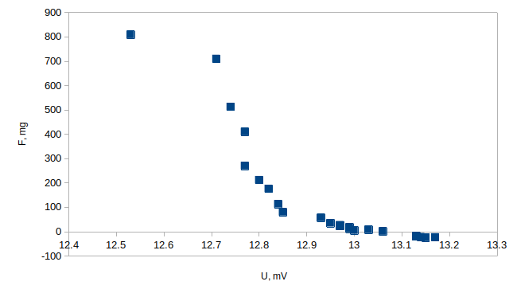

# Температура на Кюри
## Васил Николов

---

## Теоретична обосновка

Температурата на Кюри $T_c$ е критична температура за феромагнитните, като когато температурата на даден феромагнит е по-малка от $T_c$, то в него се поражда магнитен момент при поставяне във външно магнитно поле, а при $T > T_c$ магнитният момент на тялото остава нула, без значение от приложеното външно магнитно поле. Това се случва защото при по-голяма температура частиците на феромагнита имат твърде висока средна кинетична енергия, и магнитните им моменти не могат да се ориентират в една и съща посока. 

---

## Опитна постановка

За да измерим наблюдаваме преходът между феромагнитно и парамагнитно състояние поставяме образецът в магнитно поле с градиент, който е успореден на магнитното поле в дадената точка. Така полето ще намагнити образецът, а градиентът на полето ще създаде сила, която действа на образецът, като силата е пропорционална на магнитният му момент.

$$\vec{F} = \vec{M} \cdot \nabla \vec{B}$$

Вижда се, че след преминаване на температурата на Кюри силата, действаща на образецът, е нула. Можем да измерим тази сила като окачим образецът на електронна везна и мерим показанията й докато го нагряваме.

\pagebreak

На графиката е представена зависимостта на силата, действаща на образеца, като функция на напрежението на термодвойката. За да намерим температурата на Кюри, екстраполираме бързото спадане към нулата и вземаме пресечната точка на тази права с равновесното показание на везната, тоест когато температурата е над температурата на Кюри.

На долната графика се вижда само частта от графиката, където силата, действаща на образеца, спада много бързо.

\pagebreak

Като екстраполираме спадането на силата до правата $F = -38 mg$, което е равновесната сила в нашия случай, получаваме $U_T = 12.9 mV$. На това напрежение отговаря на температура на Кюри $T_c \approx 610 K$. Образецът най-вероятно е от Никел.

