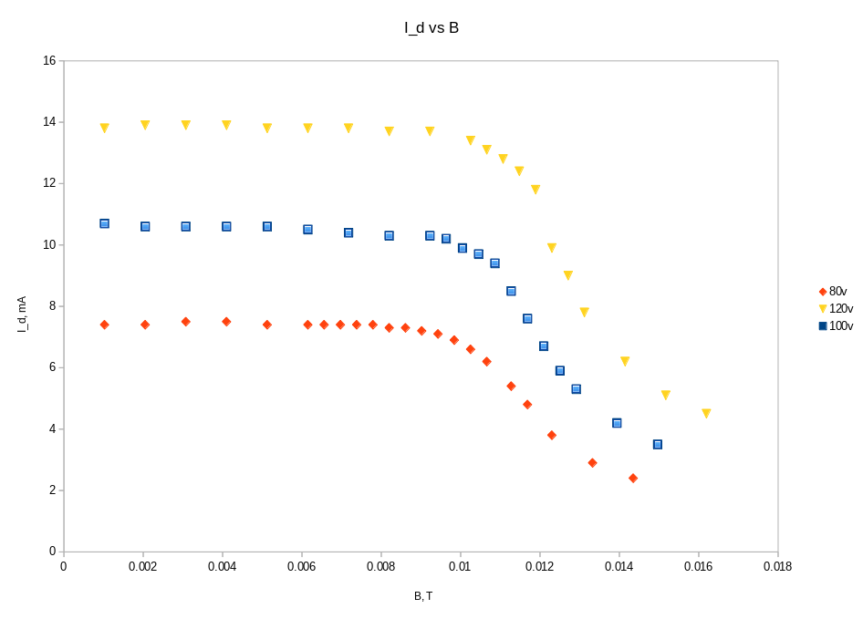

# Специфичен заряд на електрона
## Васил Николов

Специфичният заряд на електрона е отношението на зарядът към масата му, $\frac{e}{m_e}$. Той може да се измери от физически установки директно, без да се знаят стойностите на масата и зарядът на електрона поотделно. В упражнението се използва взаимодействието на електрони с магнитно и електрично поле едновременно, във вакуумен диод. Правят се два вида измервания -термоелектронна и фотоелектронна емисия.

### 1. Термоелектронна емисия
#### Теоретична обосновка

Катодът на вакуумният диод се нагрява, което заедно с електричното поле между него и анода произвежда термоелектрони. Диодът е поставен във външно магнитно поле, което действа заедно с електричното между анода и катода

\pagebreak

Когато електроните се движат във взаимно перпендикулярни магнитно и електрично поле, траекториите им са приблизително окръжности. С нарастващо електрично поле радиусът на окръжностите намалява, и когато това става във фотодиодът, има една критична стойност на магнитното поле, след която електроните не могат да стигнат до анода. Това означава, че не може да протича ток. Този феномен се наблюдава при постоянно напрежение между анода и катода и променлива стойност на тока през намотката, която създава външното магнитно поле. Така можем да измерим критичната стойност на магнитното поле $B_{cr}$, след която токът през вакуумният диод започва рязко да спада. Можем да изведем следната формула за $\frac{e}{m_e}$:

$\frac{e}{m_e} = \frac{8Ur_a^2}{B_{cr}^2(r_a^2 - r_k^2)^2}$ 

#### Експериментални данни

На графика 1 е представена зависимостта на протичащият ток през диода като функция на магнитното поле, за три напрежения на диода - 80, 100 и 120V. 

Критичните стойности на магнитното поле за съответните напрежения са:

|U, V |B, mT|
| --- | ---|
| 80  | 11 |
| 100 | 12 |
| 120 | 12.5|

Когато осредним стойностите на пресметнатият специфичен заряд на електрона получаваме 

### 2. Фотоелектрони

Установката е подобна на горната, но електроните се получават от фотоелектронна емисия, и магнитното поле е перпендикулярно на електричното
