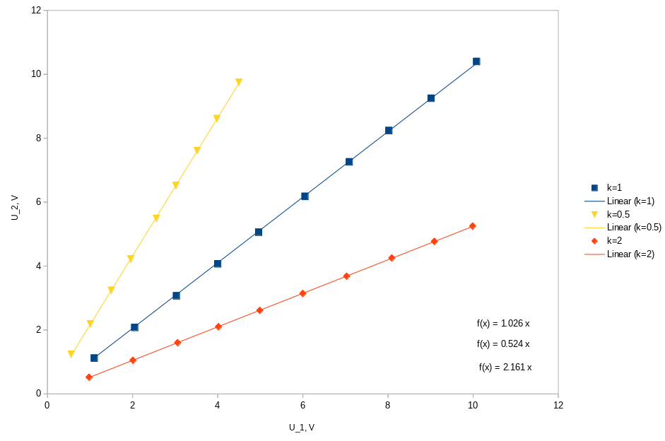

# Трансформатори
### Васил Николов

## 1. Теоретична обосновка

Трансформаторът е устройство, което може да понижава или повишава променливи напрежения. Той се състои от поне две намотки, през които минава обща феромагнитна сърцевина. Така потокът на магнитното поле през едната е приблизително равен на потокът през другата, и токовете и напреженията през едната и другата намотка са свързани. Обикновено свързваме даден източник на напрежение към едната намотка на трансформатора, и използваме другата намотка за създаденото в нея напрежение. Нека входното и изходното напрежение са съответно $U_1$ и $U_2$. Тогава за ненатоварена изходна намотка ($I_2 = 0$) е в сила равенството 

$$\frac{U_1}{U_2} = \frac{N_1}{N_2} = k \tag{1}$$

Тук $N_1$ и $N_2$ са броя на навивките на първичната и вторичната намотка около сърцевината. Коефициентът $k$ се нарича коефициент на трансформация и е фиксиран за даденото устройство. 

Когато вторичната намотка е закъсена ($U_2 = 0$), то между токовете, протичащи в двете намотки има следната зависимост:

$$\frac{I_2}{I_1} = \frac{N_1}{N_2} = k \tag{2}$$

## 2. Експериментални данни

### 2.1 Ненатоварена вторична намотка

Първата част на експеримента цели да провери уравнение $(1)$. За целта се свързва първичната намотка към източник на променливо напрежение, и се мери резултантното напрежение на вторичната намотка. На графика 1 е представена зависимостта на $U_2$ от $U_1$ за различни отношения на броя навивки $\frac{N_1}{N_2}$. 

\pagebreak

От графиката се виждат уравненията на фитираните линии към съответните серии данни. Те, както и очакваните им теоретични стойности, са представени в долната таблица

| k=$\frac{N_1}{N_2}$ | $\frac{U_2}{U_1}$ | $(\frac{U_2}{U_1})_0$
| ----                | --------          | --- 
| 1 | 1.026 | 1 |
| 0.5 | 2.161 | 2 | 
| 2 | 0.524 | 0.5 | 

### 2.2 Закъсена вторична намотка

Втората част на експеримента проверява равенство $(2)$. За целта закъсяваме вторичната намотка с амперметър, а токът през първичната се мери с втори амперметър. Зависимостите на $I_2$ от $I_1$ за различни стойности на $k$ са представени на графика 2. 
