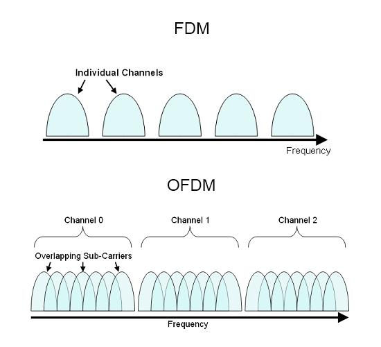
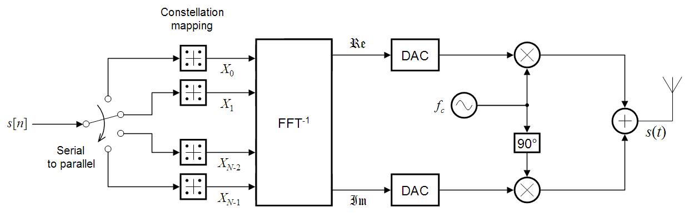
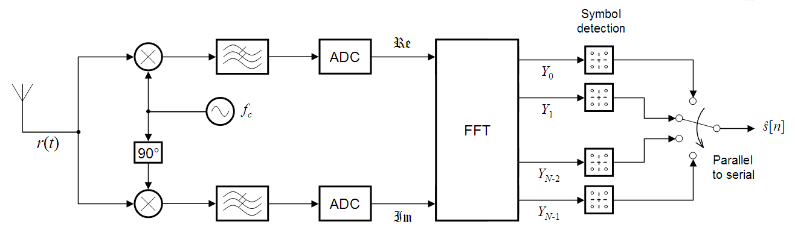

# OFDM - Orthogonal frequency division multiplexing
## Васил Николов - 6PH0100005

## 1. Описание

OFDM е вид FDM, или frequency division multiplexing. Идеята е да се използва един канал за пренасяне (радиовълни във въздуха, кабел, други) за предаване на няколко независими потока информация на различни честоти. Технологията се използва на множество места, включително кабелна телевизия, радио предавания от сателити и други. 

На фигурата е представено разбиването на подканали по честота на честотният интервал (bandwidth) на средата, през която предаваме информацията. Докато при FDM различните подканали, по които се предава информацията, не могат да се припокриват по честота, OFDM позволява припокриване, което после се декодира чрез бърза Фурие трансформация (FFT). Ортогоналността на честотите, които съотвестват на два различни символа означава, че ако сигналите, отговарящи на два различни символа са $v_1(t)$ и $v_2(t)$, то е вярна формулата 

$$\int_0^T v_1^{\*}(t) v_2(t) dt = 0$$

Тук $T$ е времето за предаване на един символ по даден канал, като по идея то е значително по-дълго от периода на модулираният сигнал (carrier wave). Заради ортогоналността на сигналите е възможно честотите на съседни подканали да се припокриват, но това да не нарушава цялостта на данните. Горното условие за ортогоналност се постига когато разликата в честотите на кои два подканала е цяло число, разделено на времето за предаване на един символ $T$, или иначе казано:

$$\Delta f = \frac{k}{T}, \ k \in \mathbb{N}$$ 

## 2. Модулация и демодулация

На долните две фигури са представени схемите за модулация (превръщане на дигитални данни в радио сигнал) и демодулация (извличане на цифрови данни от засечените радио вълни)

OFDM не специфицира вид модулация на сигнала, но най-често се използва PSK (Phase Shift Keying). На фигурите горе е представена модулация с QPSK (Quadrature Phase Shift Keying), където един символ е 2 бита (има 4 възможни стойности на фазата на сигнала).

## 2. Предимства

OFDM използва честотният канал на дадена среда (въздух, кабел, други) като модулира множество честоти с ниска скорост на предаване на данните(symbol rate) вместо една честота с висока скорост на предаване на данни. Предимството на това е че времето за предаване на един бит е по-голямо, което подпомага за по-добра устойчивост на шумове. 

