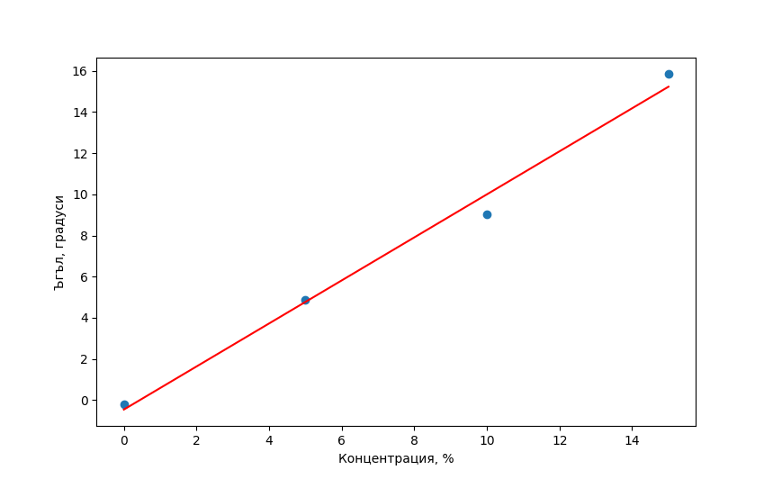
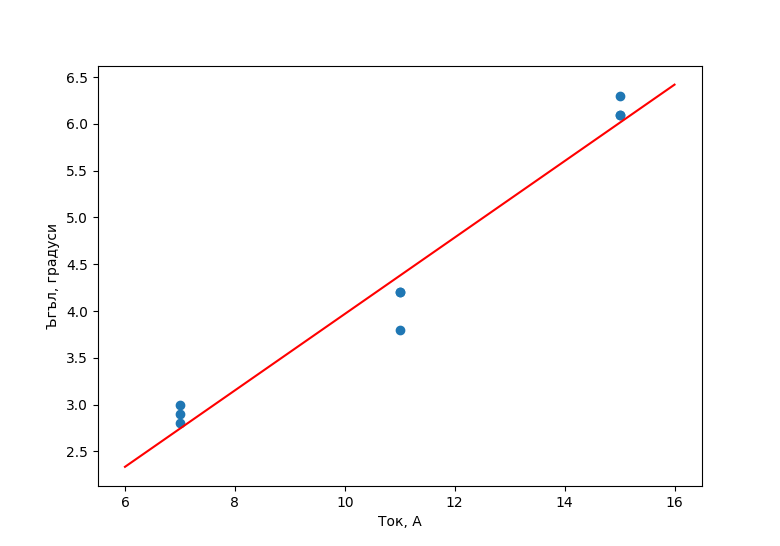

# Въртене на равнината на поляризация на светлината
### Васил Николов

## 1. Поляризация на светлината

При линейно поляризирана светлина векторът на електричното поле $E$ трепти в една права, перпендикулярна на посоката на разпространение на светлината. Равнината, образувана от посоката на движение (или вълновият вектор $\vec{k}$) и правата, в която трепти електричното поле, се нарича равнина на поляризация. Някои вещества имат свойството да въртят равнината на поляризация на светлина, преминаваща през тях. За да се обясни това свойство се забелязва, че през тези вещества ляво и дясно поляризирана светлина се движат с различни скорости. Тъй като можем да представим линейно поляризираната светлина като сума от ляво и дясно поляризирана светлина, когато те се движат през оптично активното вещество техните фази започват да се разминават. Ъгълът на завъртане на равнината е пропорционален на пътят, който светлината е преминала през оптично активното вещество:

$$ \phi = k d, \ k = \text{const} $$

Ако активното вещество е разтворено в неактивен разтворител, константата $k$ е пропорционална на концентрацията на разтвора. Тогава горното уравнение става

$$ \phi = \alpha C d, \ \alpha = \text{const} $$

Тук $\alpha$ е константа, зависеща от разтвореното активно вещество.

## 2. Магнитно индуцирана оптична активност

Някои вещества, които не са оптично активни, могат да придобият оптична активност ако бъдат поставени във външно магнитно поле. Тогава константата $\alpha$ е пропорционална на приложеното магнитно поле:

$$ \phi = V |\vec{B}| d \ \tag{1}$$

$V$ отново е константа, зависеща от активното вещество. Тя се нарича константа на Верде.

## 3. Експериментална установка

За измерване на ефекта се ползва поляриметър. 

&nbsp;

&nbsp;

&nbsp;

&nbsp;

&nbsp;

&nbsp;

&nbsp;

&nbsp;

&nbsp;

&nbsp;

&nbsp;

&nbsp;

На горната фигура се вижда устройството му. Монохроматичен лъч преминава през поляризатор $P$, за да се получи линейно поляризирана светлина. След това половинана от лъчът преминава през кварцова пластина, която завърта неговата равнина на поляризация на малък ъгъл. Целият лъч преминава през кювета, която може да съдържа оптично активно вещество, и след това през втори поляризатор, който в началото е завъртян на $90^{\circ}$ спрямо първия. През окуляр наблюдаваме и двата лъча с око. Вторият поляризатор може да се върти около оста на прибора, и така се променя каква част от лъчите виждаме. Първо калибрираме уреда, като премахваме оптично активното вещество, и записваме ъгълът на втория поляризатор, при който двете половини на лъча изглеждат еднакво ярки. След това добавяме оптично активното вещество, и отново въртим втория поляризатор докато не видим две еднакво силни половини на лъча. Записваме и този ъгъл, и разликата между двата ъгъла е точно ъгълът, на който оптично активното вещество е завъртяло равнината на поляризация. 

## 4. Мерене на оптична активност на захарен разтвор

Правят се измервания на дестилирана вода и четири различни концентрации на захарен разтвор. Графиката на ъгълът на завъртане като функция на концентрацията е представена долу

\pagebreak

Уравнението на правата, описваща най-добре точките, е

$$ \phi_{[deg]} = 1.05 C_{[\%]} - 0.46 $$

По тази формула определяме неизвестната концентрация на петия разтвор. Неговият измерен ъгъл на въртене е $\phi_x = 8.08^{\circ}$, което отговаря на концентрация 

$$ C_x = 8.1 \% $$

## 5. Мерене на магнитно индуцирана оптична плътност

За да мерим магнитно индуцираната оптична активност поставяме поляриметърът в магнитно поле, което съвпада с оста на уреда. Тъй като използваме лазер мерим ъгълът, при който завъртяният лъч се поглъща напълно от втория поляризатор. Мерим този ъгъл два пъти, в две противоположни посоки на приложеното магнитно поле. Тогава истинският ъгъл на завъртане е 

$$ \phi = \frac{\phi_{+} - \phi_{-}}{2} $$

На графиката долу е представена зависимостта на ъгълът, с който вода завърта равнината на поляризация като функция на тока през намотките, пораждащи магнитното поле.

Уравнението на правата, която най-добре описва точките, е

$$ \phi_{[deg]} = 0.408 I_{[A]} - 0.11$$

Използвайки уравнение 1 и горното уравнение стигаме до извода, че 

$$ B = \frac{0.408 I_{[A]} - 0.11}{V_{h2o} d_{h2o}}$$

Тук $V_{h2o}$ e константата на Верде за дестилираната вода, а $d_{h2o}$ е дължината на кюветата, в случая $d_{h2o} = 5.8 \ cm$

Този експеримент се използва за калибровка на уреда. Вече може да се измерва константа на Верде на различни вещества. В този експеримент се използва кварц с дължина на образеца $d_q = 5.6 \ cm$. Нека неговата константа на Верде е $V_q$.

$$V_q = \frac{\phi_q V_{h2o} d_{h2o}}{(0.408 I_{[A]} - 0.11) d_q}$$

От измервания установяваме, че $\phi_q = 22.3^{\circ}$ при ток 14 А. Това води до $V_q = 4.12 V_{h2o}$ 

